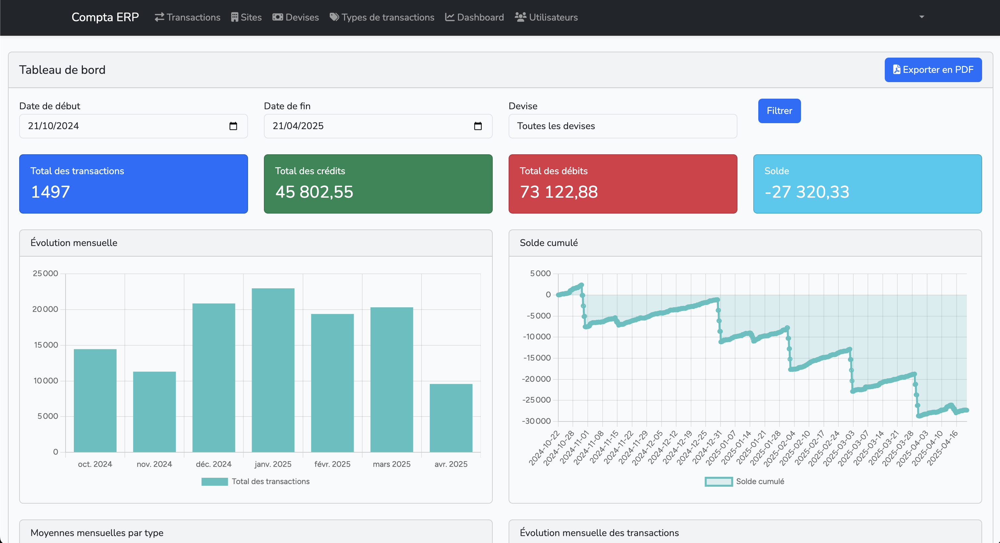

# Compta-ERP

Un système de gestion comptable et ERP open-source développé avec Laravel.

[](https://github.com/djoyromeo-git/Compta_.git)

## Description

Compta-ERP est une application web de gestion comptable et ERP (Enterprise Resource Planning) développée avec le framework Laravel. Elle permet de gérer efficacement les aspects financiers et opérationnels d'une entreprise.

## Aperçu



*Capture d'écran du tableau de bord montrant les statistiques financières, l'évolution mensuelle des transactions et le solde cumulé.*

### Fonctionnalités principales

- Gestion des transactions financières
- Gestion des devises
- Gestion des types de transactions
- Gestion des sites
- Génération de rapports PDF
- Interface utilisateur moderne et intuitive

## Prérequis

- PHP 8.1 ou supérieur
- Composer
- Base de données MySQL/PostgreSQL
- Serveur web (Apache/Nginx)

## Installation

1. Clonez le dépôt :
```bash
git clone https://github.com/djoyromeo-git/Compta_.git
cd Compta_
```

2. Installez les dépendances PHP :
```bash
composer install
```

3. Copiez le fichier d'environnement :
```bash
cp .env.example .env
```

4. Générez la clé d'application :
```bash
php artisan key:generate
```

5. Configurez votre base de données dans le fichier `.env` :
```
DB_CONNECTION=mysql
DB_HOST=127.0.0.1
DB_PORT=3306
DB_DATABASE=compta_erp
DB_USERNAME=votre_utilisateur
DB_PASSWORD=votre_mot_de_passe
```

6. Exécutez les migrations et les seeders :
```bash
php artisan migrate --seed
```

7. Lancez le serveur de développement :
```bash
php artisan serve
```

## Structure du projet

- `app/` - Contient la logique principale de l'application
  - `Http/` - Contrôleurs et requêtes
  - `Models/` - Modèles Eloquent
  - `Providers/` - Fournisseurs de services
- `database/` - Migrations et seeders
- `public/` - Fichiers publics et assets
- `resources/` - Vues et assets compilés
- `routes/` - Routes de l'application

## Dépendances principales

- Laravel Framework 10.x
- Laravel Sanctum pour l'authentification
- Laravel UI pour l'interface utilisateur
- DomPDF pour la génération de PDF
- Guzzle pour les requêtes HTTP

## Contribution

Les contributions sont les bienvenues ! Pour contribuer :

1. Fork le projet
2. Créez une branche pour votre fonctionnalité (`git checkout -b feature/AmazingFeature`)
3. Committez vos changements (`git commit -m 'Add some AmazingFeature'`)
4. Push vers la branche (`git push origin feature/AmazingFeature`)
5. Ouvrez une Pull Request

## Licence

Ce projet est sous licence MIT. Voir le fichier `LICENSE` pour plus de détails.

## Support

Pour toute question ou problème, veuillez ouvrir une issue sur GitHub.
